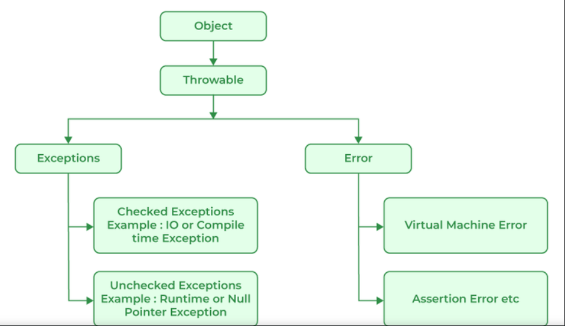
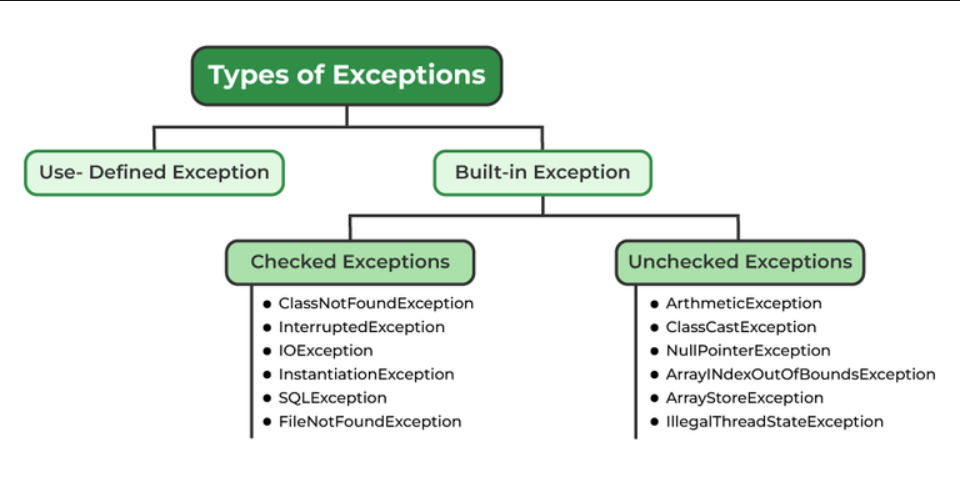
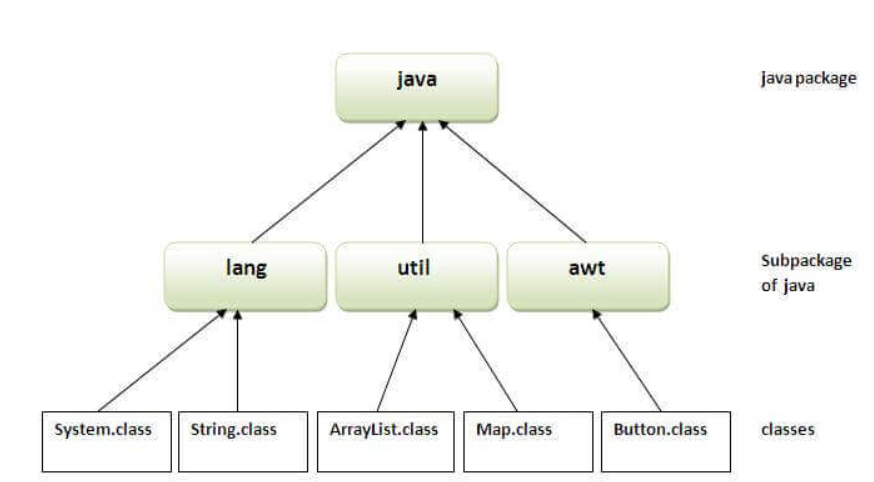

# fundamentals - 
    basic syntax , datatype  , variables , conditionals , functions , working with date and time , loops , exception handling ,  Data structure , opps Interface Class , packages , working with file and API

# There are three types of exceptions -

## Checked Exception - exceptions checked at compile time. Example - IOException
## Unchecked Exception - exceptions checked at run time. Example - NullPointerException
## Error - It is irrecoverable. Example - OutOfMemoryError

## exception handling in java -
- exception handling in java is one of the effective way to handle the runtime errors to preserve the flow of java application 

- runtime error - runtime error is not the syntax error it comes when the computer is trying to do something which it really can't do.

- exception is unwanted and unexcepted event which break the normal flow of the program

       when execption come in the program it crate the exception object it contain the information about the exception major reason the exception occers
        Invalid user input
        Device failure
        Loss of network connection
        Physical limitations (out-of-disk memory)
        Code errors
        Opening an unavailable file

## exception hierarchy

# types

# packages - A java package is a group of similar types of classes, interfaces and sub-packages.

## Package in java can be categorized in two form, built-in package and user-defined package.

- what class use in java come from the package

        bydefault java have a import java.lang.* package we no need to import it
        * means the all the files not all the folders(if we are use it then we can't asecc the files which is inside the folders)

- if we creating the package when the name of the package should be unique 

        how to unique - reserving the domain name
        eg - making the package for google then 
            we give the name like import com.google.calculation

