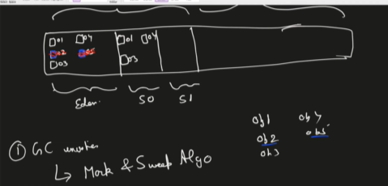
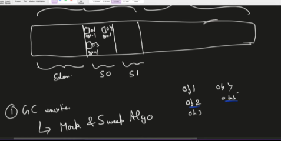
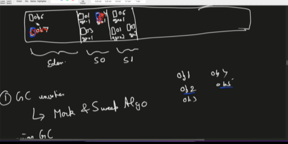
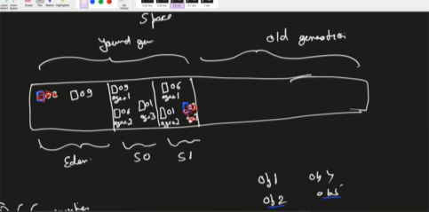
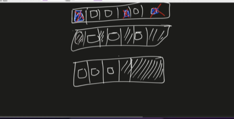

# types of the memory/RAM :--
    -stack 
    -heap
    both stack and heap is created by jvm(java virtual machine)

# what kind of data store in thee stack and heap

## stack memory :------

    1=> store the temporary variables and separate memory block for method
    2=> store the primitive datatype
    3=> store reference of the heap object
        - strong reference
        - weak reference 
            *soft reference
    4=> each thread have different stack memory but all thread have same heap meemory
    5=> variables within the scope is visible as soon as it is out side the scope it get deleted(in LIFO order)
    6=> when stack memory is full is shows java.lang.StackOverflowError
    
```java
    public class one {
    public static void main(String[] args) {
        int privateVariable = 10;
        Person personObj = new Person();
        String stringLiteral = "24"; // it create the string pool in the heap
        MemoryManagement memobj = new MemoryManagement();
        memobj.MemoryManagementTest(personObj);
    }
    private void MemoryManagementTest(Person personObj){
        Person personObj2 = personObj;
        String stringLiteral2 = "24";
        String stringLiteral3 = new String("24");

    }
}
```


### all things in the stack is being deleted when the work is over now te question comes how we clean the heap so here comes the garbage collection. running the garbage collecter is totally dependend upon the garbage collector


## reference -

### strong reference - strong reference tell garbage collector that i have a reference block dont delete the object
### weat reference - it tells that i have a weak reference of the object if the heap getting fill fast then it tell the garbage collector to delete the weak reference and then if we try to access then it give the null value
### soft reference - if there is very urgent(heap is almost fill) then delete wise not 


# HEAP MEMORY - there are teo type 

## 1 => young generation (minor gc)
## 2 => old generation / tenured generation - a)eden b)s0 c)s1(survior space) (major gc)
## 3 => Metaspace/Nonspace

    1---whenever we create the new object the firstly we store in eden
    2--- after garbage collecter envokes then Garbage collector do two things
        
        --- mark and sweap algorithm - 
            -- Mark -> check the object which have no reference then mark that object .
            -- sweap -> do that delete the mark object and move the other object into the s0 space.

### 1 gc envokes

    
    now we create the new object then another garbage collecter envokes then
    --- alternative we put in s0 and s1 and increase the age
### 2 gc envokes


    age it is created by minor garbage collector

    threshold age is reach 3 then we have to promote them
### 3 gc envokes


### promotion of the object which cross the threshold 
## the promoted object store in the ***old generation*** and in the old generation we have ***major garbage collection*** which check in the gap og apporex 30min

## mata space / permanent generation - store class variables , class meta data(store info about the class from which object is being created), constants  
    permanent generation is connect with the heap but meta space is not connected

# garbage collecter algorithm :-
    --- make and sweap algorithm
    --- make and sweap algorithm with compact memory
  - it compact the memory

## version gc 

### 1--serial gc  (1 thread) 
    disadv --- slow , explensive(when serial gc envoke then all application is stop)
### 2--parallel gc (default in java) 
    - multi thread
### 3--concurend mark and sweap(CMS)
    - when application is working then the gc is also working parallel but CMS nit sure 100% that application will nit stop 
    
### 4--GI garbage collecter
    - same as CMS nut the compaction is also there
