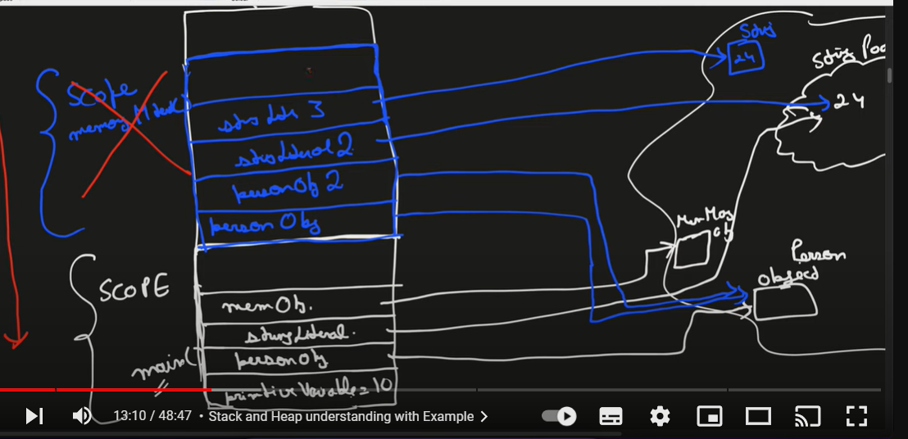
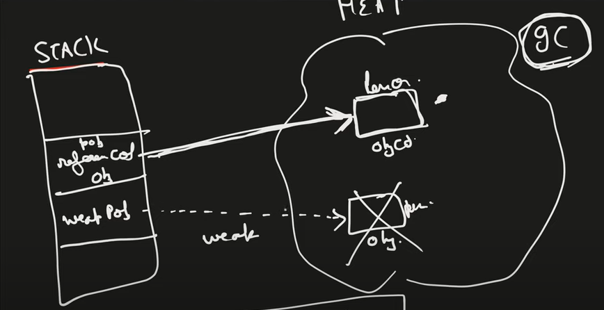

# types of the memory/RAM :--
    -stack 
    -heap
    both stack and heap is created by jvm(java virtual machine)

# what kind of data store in thee stack and heap

## stack memory :------

    1=> store the temporary variables and separate memory block for method
    2=> store the primitive datatype
    3=> store reference of the heap object
        - strong reference
        - weak reference 
            *soft reference
    4=> each thread have different stack memory but all thread have same heap meemory
    5=> variables within the scope is visible as soon as it is out side the scope it get deleted(in LIFO order)
    6=> when stack memory is full is shows java.lang.StackOverflowError
    
```java
    public class one {
    public static void main(String[] args) {
        int privateVariable = 10;
        Person personObj = new Person();
        String stringLiteral = "24"; // it create the string pool in the heap
        MemoryManagement memobj = new MemoryManagement();
        memobj.MemoryManagementTest(personObj);
    }
    private void MemoryManagementTest(Person personObj){
        Person personObj2 = personObj;
        String stringLiteral2 = "24";
        String stringLiteral3 = new String("24");

    }
}
```


### all things in the stack is being deleted when the work is over now te question comes how we clean the heap so here comes the garbage collection. running the garbage collecter is totally dependend upon the garbage collector


## reference -

### strong reference - strong reference tell garbage collector that i have a reference block dont delete the object
### weat reference - it tells that i have a weak reference of the object if the heap getting fill fast then it tell the garbage collector to delete the weak reference and then if we try to access then it give the null value
### soft reference - if there is very urgent(heap is almost fill) then delete wise not 



