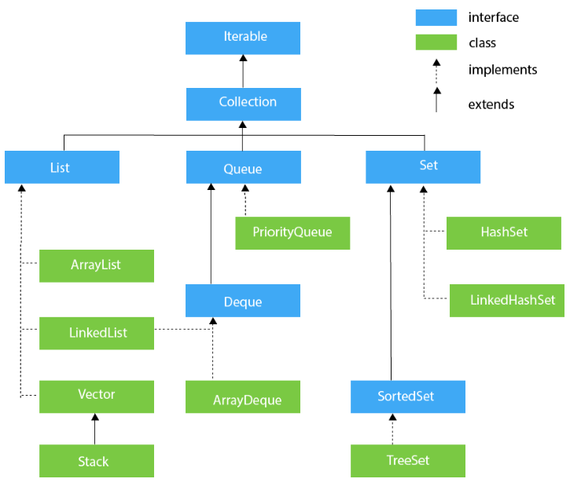

# COLLECTION FRAMEWORK :-
## collection in java is the framework that provide the structure to manipulate and store the data .
## - collection are like the data structure its is like the collection of data structure 
## - in java the collection is implemented using class , interface and  abstract classes

# ArrayList ---
    --use the array to store the actual element.
    operation:----
    remove --- O(n)
    add --- O(n)
    conatain --- O(n)

# linkedList --- 
    in ll we store the data in node and that node contain the address of the next node
    operation:---
    remove -- O(1)
    add -- O(1)
    contain -- O(n)

# Queue ---
    it give to add and delete the element from both end.
    operation---offer , poll

# Priority Queue ---
    when we want to remove any element then it select on the bases on priority Queue.

# HashMap ---
    in this ds we store the element in the bases of key and value pair where the key are unique 
    operation get,put

# ***HashSet , Linked HashSet , TreeSet***

# TreeMap --- RBT (red black tree)

# set --- it is similar to the list but the only difference is that it is not allowed the duplicate element. 